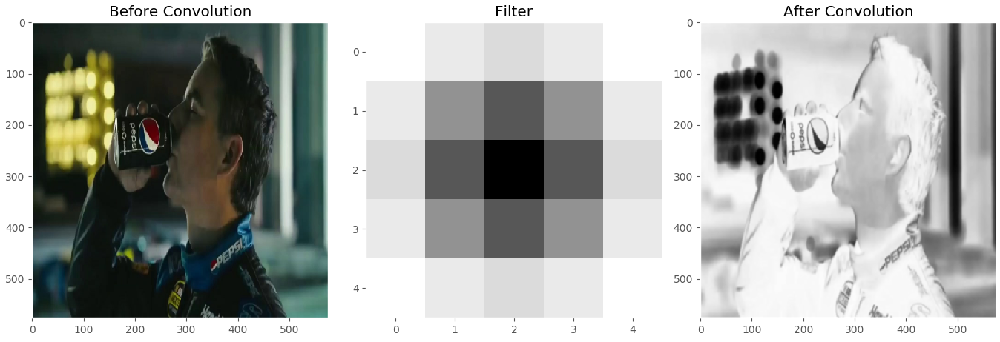

# logo-recognition-from-video
Logo detection and recognition from advertisement videos using OpenCV and TensorFlow.

# Process

### 0) Obtain .mp4 advertisement videos
Pull videos from youtube.</img>

### 1) Create .jpg frames from .mp4 video
Extract frames.</img>
 use frame_extractor.py

### 2) Create binary image
Convert to binary to simplify segmentation.</img>
 use label_segments in detect_circle.py

### 3a) Blur image with CV2
Use CV2 to blur image.</img>

### 3b) Apply Gaussian filter to iamge
Gaussian filter (5x5) on grayscale image.</img>

### 3) Detect circles
use parse_image in detect_cicle.py
